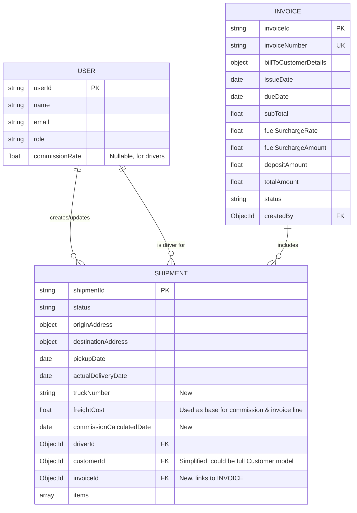
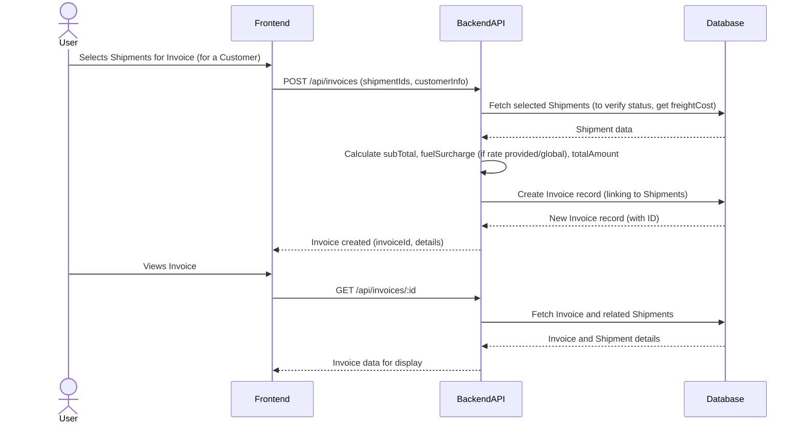

# Plan for Implementing Driver Commission and Invoice Reports

This document outlines the plan to integrate driver commission and invoice reporting features into the ScrapTrack application.

**I. Data Model Modifications & Additions**

We'll need to update existing models and potentially introduce new ones.

**A. `Shipment` Model (`ScrapTrack/ScrapTrack/backend/src/models/Shipment.js`) Modifications:**

*   **Add `truckNumber`:**
    *   `truckNumber: { type: String }` (To store the truck number used for the shipment).
*   **Clarify `freightCost` Usage:**
    *   This field will be the primary source for the "Amount" in the commission report and the base amount for line items in the invoice.
*   **Add `commissionCalculatedDate`:**
    *   `commissionCalculatedDate: { type: Date }` (To track when commission for this shipment was processed).
*   **Add `invoiceId`:**
    *   `invoiceId: { type: Schema.Types.ObjectId, ref: 'Invoice' }` (To link a shipment to an invoice if it has been invoiced).

**B. `User` Model (`ScrapTrack/ScrapTrack/backend/src/models/User.js`) Modifications:**

*(Assumption: This file exists and is structured similarly to `Shipment.js`)*

*   **Add `commissionRate` (for drivers):**
    *   `commissionRate: { type: Number, min: 0, max: 1, default: 0.10 }` (To store the driver's commission rate, e.g., 0.10 for 10%). This assumes a way to identify users with a 'driver' role.

**C. New `Invoice` Model (e.g., `ScrapTrack/ScrapTrack/backend/src/models/Invoice.js`)**

```javascript
const mongoose = require('mongoose');
const Schema = mongoose.Schema;

const invoiceSchema = new Schema({
  invoiceNumber: { // Auto-generated or manually entered
    type: String,
    required: true,
    unique: true,
    trim: true
  },
  billTo: { // Customer details
    name: { type: String, required: true }, // From Shipment.customer.name
    contactEmail: { type: String },
    // Potentially full address if needed, mirroring Shipment.customer or a dedicated Customer model
  },
  issueDate: {
    type: Date,
    required: true,
    default: Date.now
  },
  dueDate: {
    type: Date
  },
  shipments: [{ // Array of shipments included in this invoice
    type: Schema.Types.ObjectId,
    ref: 'Shipment',
    required: true
  }],
  subTotal: { type: Number, required: true }, // Sum of freightCost from all included shipments
  fuelSurchargeRate: { type: Number, default: 0.0 }, // e.g., 0.05 for 5%
  fuelSurchargeAmount: { type: Number, default: 0.0 },
  depositAmount: { type: Number, default: 0.0 },
  totalAmount: { type: Number, required: true },
  status: {
    type: String,
    enum: ['draft', 'sent', 'paid', 'partially-paid', 'overdue', 'void'],
    default: 'draft'
  },
  notes: String,
  createdBy: {
    type: Schema.Types.ObjectId,
    ref: 'User'
  },
  // Add payment history if needed
}, { timestamps: true });

invoiceSchema.index({ invoiceNumber: 1 });
invoiceSchema.index({ status: 1 });
invoiceSchema.index({ 'billTo.name': 1 });

// Pre-save hook to calculate totals might be useful
invoiceSchema.pre('save', function(next) {
  // this.subTotal = 0; // Will be calculated based on linked shipments' freightCost
  // Logic to sum freightCost from shipments would go here or in the controller
  // this.fuelSurchargeAmount = this.subTotal * this.fuelSurchargeRate;
  // this.totalAmount = (this.subTotal + this.fuelSurchargeAmount) - this.depositAmount;
  next();
});

module.exports = mongoose.model('Invoice', invoiceSchema);
```

**II. Logic and Calculations**

**A. Driver Commission Calculation:**

1.  **Identify Eligible Shipments:** Find shipments that are `delivered` and for which commission has not yet been calculated (e.g., `commissionCalculatedDate` is null).
2.  **For each eligible shipment:**
    *   Retrieve the `driver` (`Shipment.driver`).
    *   Retrieve the driver's `commissionRate` from their `User` profile.
    *   The base "Amount" for commission is `Shipment.freightCost`.
    *   `Commission Amount = Shipment.freightCost * User.commissionRate`.
3.  **Report Fields (based on example Excel):**
    *   `Date`: `Shipment.actualDeliveryDate` (fallback: `estimatedDeliveryDate`, then `pickupDate`).
    *   `Shipment #`: `Shipment.shipmentId`.
    *   `Destination`: `Shipment.destination.city`.
    *   `Driver`: `User.name` (from `Shipment.driver` reference).
    *   `Truck #`: `Shipment.truckNumber`.
    *   `Price` (Excel column): `Shipment.freightCost` (or a rate that leads to it).
    *   `Weight`: `Shipment.totalWeight` (or sum of `Shipment.items[].weight`).
    *   `Amount`: `Shipment.freightCost`.
    *   `Commission Amount`: Calculated as above.

**B. Invoice Calculation:**

1.  **Create Invoice:** User initiates invoice creation, selecting one or more `delivered` shipments for a specific customer.
2.  **Populate Invoice Fields:**
    *   `invoiceNumber`: Generate (e.g., sequential).
    *   `billTo`: From `Shipment.customer` details.
    *   `shipments`: Array of selected `Shipment._id`.
3.  **Calculate Amounts:**
    *   `subTotal`: Sum of `freightCost` for all `Shipment` records linked to the invoice.
    *   `fuelSurchargeRate`: Configurable value.
    *   `fuelSurchargeAmount = invoice.subTotal * invoice.fuelSurchargeRate`.
    *   `depositAmount`: Entered by the user if applicable.
    *   `totalAmount = (invoice.subTotal + invoice.fuelSurchargeAmount) - invoice.depositAmount`.
4.  **Report Fields (based on example Excel):**
    *   `Date`: `Shipment.actualDeliveryDate` (for each line item/shipment).
    *   `Shipping #`: `Shipment.shipmentId`.
    *   `Destination`: `Shipment.destination.city`.
    *   `Driver`: `User.name` (from `Shipment.driver`).
    *   `Trk #`: `Shipment.truckNumber`.
    *   `Price` (Excel column): If needed for display, `Shipment.freightCost / Shipment.totalWeight`.
    *   `Weight`: `Shipment.totalWeight`.
    *   `Amount`: `Shipment.freightCost`.

**III. API Endpoints (High-Level)**

*   **Commission Report:**
    *   `GET /api/reports/commission?driverId=<id>&startDate=<date>&endDate=<date>`
*   **Invoice Management:**
    *   `POST /api/invoices` (Create new invoice from shipments)
    *   `GET /api/invoices` (List invoices, with filters)
    *   `GET /api/invoices/:id` (Get specific invoice details)
    *   `PUT /api/invoices/:id` (Update invoice)
    *   `GET /api/invoices/:id/pdf` (Generate PDF)

**IV. Report Generation (Frontend/Backend)**

*   **Driver Commission Report:** Frontend table view, option to export.
*   **Invoice:** Frontend view for management. PDF generation (backend or frontend).

**V. Diagrams**

**A. Data Model Overview (Mermaid)**



**B. Invoice Generation Flow (Mermaid)**


**VI. Initial Assumptions & Questions for Refinement (Record)**

1.  **`freightCost` Usage:** Assumed as primary source for commission "Amount" and invoice line item base.
2.  **`commissionRate` Storage:** Assumed on `User` model for drivers.
3.  **Fuel Surcharge:** Assumed as a rate on the `Invoice` model.
4.  **`User` Model Structure:** Assumed typical structure for user name and roles.
5.  **Invoice Number Generation:** Assumed a generation strategy will be decided (e.g., sequential).
6.  **Fuel Surcharge Rate Source:** Assumed configurable per-invoice or globally.
7.  **Invoice Line Items:** Assumed one line per shipment. Itemizing `Shipment.items` would require more complex invoice structure.
8.  **Date for Reports:** `Shipment.actualDeliveryDate` prioritized.
9.  **Destination for Reports:** `Shipment.destination.city` assumed.